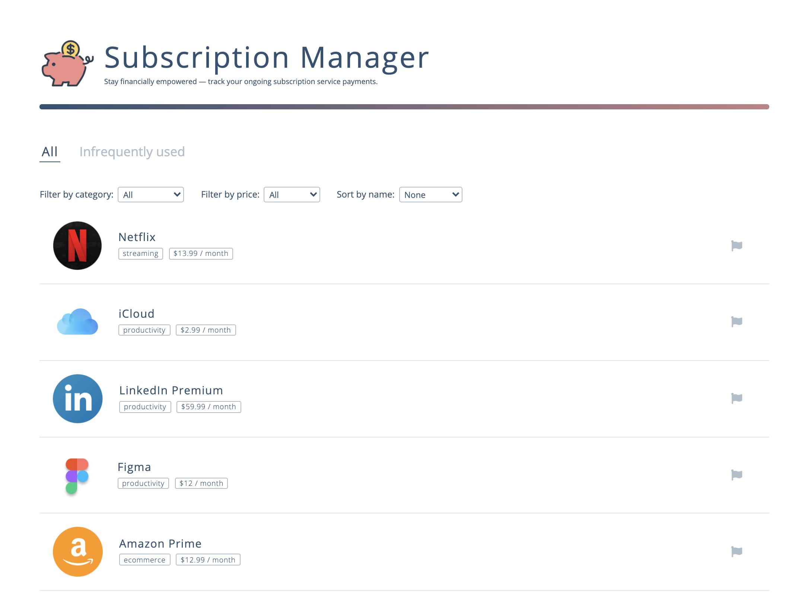

  <a href="#features">Features</a> •
  <a href="#components">Component Overview</a> •
  <a href="#future-directions">Future Directions</a>

A React application that empowers users to take control of their finances by tracking their recurring subscription payments.

## Features
### Filter and sort

1. Filter by category
2. Filter by price range
3. Sort by name

  
### Mark as infrequently used

1. Users flag subscriptions that they use infrequently and are considering cancelling
2. They can view this aggregation of subscriptions by clicking the Infrequently Used tab

  
## Components
### app.js
- Contains the page header and `ListContainer`
- Passes the data used to populate the app (12 subscription objects) to `ListContainer`
### listContainer.js
- Contains the list tab selector (All or Infrequently Used), and both the All list and Infrequently Used list

- `state` contains the selected filter and sort options, the list of subscriptions marked as infrequently used, and which list is currently on display (All or Infrequently Used)

- Filter:
  - `handleCategoryFilter` and `handlePriceFilter` functions update the state to reflect the selected category or price
    - Passed to `ListFilters`
  - `filter` function returns only the items that meet the category and price criteria
    - Called in `render()`
- Sort:
  - `handleSort` function updates the state to reflect the selected sort direction
    - Passed to `ListFilters`
  - `sort` function returns the reordered items
- Mark as infrequently used:
  - `toggleInfrequent` function updates the state with the updated infrequently used subscriptions
    - Passed to `SubscriptionList`
- Selected list display:
  - `handleSelectedList` function updates the state to reflect the selected list
    - Called `onClick` of either list tab (All or Infrequently Used)
  - `renderSelectedList` function renders either All list (comprised of `ListFilters` and `SubscriptionList`) or Infrequently Used list (`SubscriptionList`)
    - Called in `render()`

### listFilters.js
- Contains the Filter by category, Filter by price, and Sort by name dropdowns
- `onChange` of these dropdowns, calls `props.handleCategoryFilter`, `props.handlePriceFilter`, or `props.handleSort`

### subscriptionList.js
- Used for both the All and Inferquently Used list
- Displays the list of subscriptions, mapping each subscription in `props.item` to be a `ListItem`
- `onClick` of the flag icon, calls `props.toggleInfrequent`

  
## Future Directions
- More filter-able and sort-able properties (eg. subscription start date)
- Manual subscriptions add/delete
- Ability to cancel subscription directly from this platform
- Reminders for upcoming bills